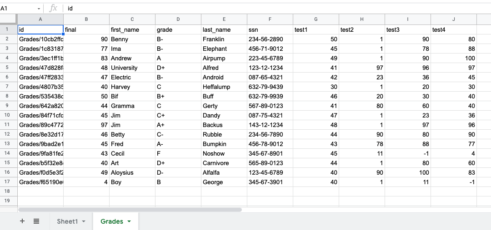

# Exporting Data to Google Sheets with Singer.io

In this tutorial, we will export data from TerminusDB to a Google Sheets with  [Singer target](https://www.singer.io/).


## Check your endpoint is running

You can download the TerminusDB docker image to work locally (recommended to use Bootstrap here) or you can connect to TerminusX. If you are using docker image, make sure that your TerminusDB container is running at localhost (https://127.0.0.1). If you are using TerminusX, get the information of the endpoint, team, and API token ready (it should be accessible in the TerminusX dashboard under profile.)


## Install the Google Sheets target

It is highly recommended to install different singer.io tap and targets in different python environments. To install the Google Sheets target from the `setup.py` in the repo into a new `venv` environment.

```
$ python3 -m venv ~/.virtualenvs/target-gsheet
$ source ~/.virtualenvs/target-gsheet/bin/activate
$ python3 -m pip install target-gsheet
$ deactivate
```

## Install TerminusDB tap

With similar principal as installing the target, we install `tap-terminusdb` from PyPI in another `venv` environment:

```
$ python3 -m venv ~/.virtualenvs/tap-terminusdb
$ source ~/.virtualenvs/tap-terminusdb/bin/activate
$ python3 -m pip install tap-terminusdb
```

we don't deactivate the environment this time as we can use the `terminusdb` command if we are in this environment. Now go to the project directory (or start a new one):

`$ cd ../google_sheets`


## start the project

Now go to the project directory (or start a new one):

`$ cd ../google_sheets`

In the project directory start a TerminusDB project:

`$ terminusdb startproject`

You will be prompt with a few questions. Pick a project name (or the database name if you already have a working database) and if you are running the localhost server with default port you can just press Enter. You have to provide the endpoint and other login information if you are using TerminusX or otherwise.

This is what I did:

```
Please enter a project name (this will also be the database name): grades_example
Please enter a endpoint location (press enter to use localhost default) [http://127.0.0.1:6363/]:
config.json and schema.py created, please customize them to start your project.
```


## Get some data in TerminusDB so we can export

For demonstration, we will load the `grades.csv` in the database `grades_example`. If you already have a working database and got data you want to export, you can skip this step.

```
$ terminusdb importcsv grades.csv
0it [00:00, ?it/s]
Schema object Grades created with grades.csv being imported into database.
1it [00:01,  1.04s/it]
Records in grades.csv inserted as type Grades into database with Random ids.
```


## Activate the Google Sheets API and Configure the target-gsheet

Follow the [step 1 and step 2 instruction here](https://github.com/singer-io/target-gsheet#how-to-use-it) to setup the Google Sheets API app and configuration for target-gsheet. *IMPORTANT: 1) When choosing the application type, choose `Desktop app` instead of `Other`(not an option any more). 2) Instead of creating `config.json`, create it as `target_config.json`.* You should now have `client_secret.json` and `target_config.json` for the target-gsheet.

Depending if you want to publish your app, you may need to submit your app for verification by Google to allow anyone with Google account to access it. For now, it's in `testing` stage. To add yourself as a test user, go to `OAuth consent screen` and add under `Test users`. You will need to login your test user account when you first run the export command.

## Pick the stream that we are going to export

Check which class type we have in the database, first we update the `schema.py` by:

`$ terminusdb sync`

Now you can look at `schema.py`, it should have been updated so you see what class types are in your schema. In our case:

```
class Grades(DocumentTemplate):
    final: Optional[float]
    first_name: Optional[str]
    grade: Optional[str]
    last_name: Optional[str]
    ssn: Optional[str]
    test1: Optional[float]
    test2: Optional[float]
    test3: Optional[float]
    test4: Optional[float]
```

We only have one class type, let's export all documents under this type into Google Sheets. First we need to put that in `config.json`, it can be done by this command:

`$ terminusdb config streams=Grades`

Now your `config.json` should be updated. For mine it's:

```
{
    "database": "grades_example",
    "endpoint": "http://127.0.0.1:6363/",
    "streams": "Grades",
    "team": "admin"
}
```


## Export the Data from TerminusDB/ TerminusX to Google Sheets

`$ ~/.virtualenvs/tap-terminusdb/bin/tap-terminusdb -c config.json | ~/.virtualenvs/target-gsheet/bin/target-gsheet -c target_config.json`

You may be prompt to login your test user account if you are running it the first time. Afterwards, check the Google sheet you are exporting to and you should see another sheet names `Grades`


